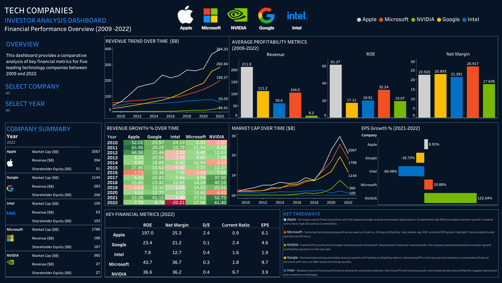

# Big Tech Financial Analysis

## Project Overview

This project entails a full analysis of five tech companies and their financial performance between 2009 and 2022.

The companies present in the analysis are:

- **Apple**
- **Microsoft**
- **Google**
- **NVIDIA**
- **Intel**

The analysis aimed to provide an overview of the five companies overall financial health, with an emphasis on 2022.

## Tools Used

- **Excel**
- **pgAdmin**
- **SQL (PostgreSQL)**
- **Tableau**

## Cleaning & Transformation

**Excel**

After downloading the dataset from [Kaggle](https://www.kaggle.com/datasets/rish59/financial-statements-of-major-companies2009-2023?select=Financial+Statements.csv), the process continued with an initial exploration of its values and data types in Excel.
The reson for this step was to provide a deeper understanding of possible inconsistencies and errors present within the dataset.

The result aknowledged messy column names which needed to be altered using SQL. It also showcased a difference in rows between the five companies used for the analysis. Microsoft and NVIDIA were the only two companies with data collected for 2023. Apple, Intel, and Google presented data ranging from 2009 and 2022. This finding concluded the decision of removing data for 2023 in order to provide a fair analysis.

___

**SQL**

Following initial exploration of the data in Excel, next step included transferring the dataset into pgAdmin for reforming column names, look for outliers, data validation, and removing redundant data not applicable for the analysis at hand.

Full cleaning and transformation process, including reasoning behind each action can be accessed here: [SQL Cleaning Process](./sql/sql-cleaning-process.md)

The SQL process also uncluded an exploratory comparison analysis of the five companies.
The analysis primarily focused on developing an initial understanding of company performance and financial health before conducting deeper comparative analysis through visualization.

Full SQL analysis process, including reasoning behind each action can be accessed here: [SQL Analysis Process](./sql/sql-analysis-process.md)

___

**Tableau**

The final step of cleaning and transforming the data included transferring it into Tableau Public for creating visualisations and a dashboard.

Before building the visuals, calculated fields were created to facilitate the use of, and enhance the understanding of data.

**Fields created include:**

- Revenue ($B)
- Shareholder Equity ($B)
- Revenue Growth %
- EPS Growth %

Originally, revenue and shareholder equity were presented in $M but for improved readability in charts, these were converted into $B.
This did not affect any metrics as they were not used to perform comparison with other values at this stage of the analysis.

Revenue and EPS Growth in % were calculated by dividing the difference in change between current year and previous year with the value of previous year, which allowed for a view of changes in the metrics over time.

The processed was finalised with a full analysis, made with the help of the dashboard and can be found below.

## Dashboard

[View Interactive Dashboard](https://public.tableau.com/views/TechCompaniesFinancialAnalysis/Dashboard1?:language=en-GB&:sid=&:redirect=auth&:display_count=n&:origin=viz_share_link)

## Analysis

***Apple***

Apple demonstrates the strongest overall financial position among the companies analysed. The company has maintained the highest average revenue throughout the years while also holding the largest market capitalization since 2018. These metrics reflect strong investor confidence, brand dominance, and consistent consumer demand.

From a profitability perspective, Apple’s ROE significantly outperforms competitors, indicating exceptional efficiency in generating shareholder returns. However, the company also presents the highest D/E ratio, suggesting that leverage and aggressive capital structure strategies contribute to these returns.

At the same time, the company's current ratio falls in at 0.9 which highlights an uncrtainty for how the company could be solvent enough to pay off all debts if product demand would rapidly decrease.
While this certainly increases financial risk, Apple’s profitability and cash generation capabilities appear sufficient at this point to support it.

As showcased on the dashboard, Apple's revenue growth has remained relatively stable over the analysed period, although growth rates from 2022 slowed compared to previous year. At the same time, EPS growth remained positive in 2022, indicating a decrease in shareholder equity.

From an investment perspective, Apple represents a relatively lower risk and long-term stability investment with strong profitability and shareholder value creation. However, future growth potential could be more moderate the coming years compared to faster growing technology competitors.

***Microsoft***

Microsoft presents the most balanced financial profile in the analysis. The company combines strong revenue expansion, stable profitability, high profitability margins, and strong market capitalisation without excessive leverage.

Compared to its long-term profitability averages, Microsoft’s 2022 metrics remain exceptionally strong, showing that the company has maintained momentum rather than experiencing stagnation. Its net margin is the highest of the companies analysed, reflecting operational efficiency and strong pricing power.

The company’s low D/E ratio indicates a healthier balance between growth and financial risk compared to Apple for example.
On top of that, EPS growth remained positive in 2022, suggesting strong earnings resulting in increased attractiveness among investors.

Overall, Microsoft appears to offer one of the strongest combinations of stable growth potential, financial stability, profitability, and manageable risk exposure. 

***NVIDIA***

NVIDIA is currently experiencing the most explosive growth trajectory among the analysed companies. Although historically smaller in revenue and overall profitability compared to the rest, the company shows an exceptional acceleration over the last years, showcased by its current profitability metrics over its averages.

With one of the top net margins in 2022, NVIDIA possesses strong pricing power and operating efficiency.
The company’s 2022 EPS growth dramatically exceeded competitors, reflecting its highly profitable increase on a per-share basis.
These two metrics combined signalise strong fundamental health, and a higher likelihood of future dividend payouts or share price appreciation.

Yet, despite having a strong net margin, NVIDIA's 2022 ROE was only 36.6%, falling below Microsoft, and substantially lower than Apple. However, this does not in any way indicate a weak operational efficiency, but rather that NVIDIA has not matured to the same stage as its competitors yet, as it is still not collecting the same amount of revenue compared to its shareholder equity. 

Although its market capitalization declined in 2022 alongside the broader technology sector, NVIDIA still maintained significantly stronger long-term growth momentum than most competitors. From an investor standpoint, NVIDIA represents a high growth, but high risk investment strongly dependent on future technological and AI market expansion.

***Google***

Google demonstrates strong financial health and one of the most conservative balance sheet structures among the companies analysed. 
Its low D/E ratio and high current ratio indicate strong liquidity and low financial risk.

The company maintains stable revenue growth throughout the period while preserving strong profitability and very low debt exposure.
Compared to competitors, Google appears less dependent on leverage to generate returns, which may appeal to more risk averse investors.

Although EPS growth turned negative in 2022, long-term revenue trends and profitability metrics remain increasingly strong. The decline in EPS growth may indicate temporary macroeconomic pressures rather than internal structural weakness.

Google’s investment profile can therefore be interpreted as a balanced growth investment with strong financial stability, lower leverage risk, and continued long-term expansion potential.

***Intel***

Intel shows the weakest financial performance among the companies analysed. While it maintained moderate revenue levels historically, recent trends indicate weakening competitiveness leading to declining investor confidence.

The dashboard highlights significantly negative EPS growth in 2022, revenue decline, and comparatively low profitability metrics, particularly to company average. Market capitalization growth also lagged substantially behind competitors, particularly compared to NVIDIA within the semiconductor sector.

Although Intel maintains moderate leverage levels and acceptable liquidity, these strengths are overshadowed by operational underperformance and declining growth momentum.

From an investor perspective, Intel appears to represent the highest risk investment among the five companies analysed. Intel may still appeal to value oriented investors expecting a long-term turnaround, but current performance indicators suggest increasingly weakening market positioning relative to competitors.

## Conclusions

The outcome of the analysis reveals a strong difference in investment attractiveness and overall financial health among the five companies.

Overall, Microsoft, showcases the strongest low risk investment profile due to its combination of increasing profitability, scale, market dominance, and financial stability.

Yet, Apple remains an incredibly strong competitor and attractive alternative option. However, at the end of 2022, the company shows signs of a growth slowdown compared to Microsoft and NVIDIA.

Between these two companies, Microsoft demonstrates the most balanced long-term performance, and while Apple delivers strong shareholder returns it simultaneously possesses higher leverage exposure. 

NVIDIA on the other hand, represents the strongest growth oriented investment opportunity, driven by rapid expansion within AI and semiconductor markets. However, the company also displays some of the weakest historical profitability averages along with an uncertain valuation sensitivity.

With this in mind, looking at the last two years, while NVIDIA offers the strongest growth opportunity, it also carries greater investment risk and potential price volatility.

In contrast, Google provides a financially conservative and stable growth profile supported by strong liquidity and low debt exposure, making it attractive for investors seeking lower financial risk. Although experiencing a drop in EPS over the last year, Google continues to expand and grow financially.

Conversely, Intel significantly underperforms competitors across profitability, growth, and investor sentiment metrics, indicating structural and competitive challenges within its market segment. The company is at this stage facing one of its toughest challenges financially over the time period examined.

Overall, the outcome highlights various financial metrics and long-term performance trends that should be considered when evaluating potential investment opportunities within the technology sector.

## Recommendations

LOW RISK STABLE OPTION

Investors seeking long-term stability and lower risk may prefer Microsoft due to its strong profitability, and stable financial performance. At the end of 2022, Microsoft displays the most persuasive, well rounded investment proposition.

Its Net Margin being top of the group and substantially higher than its average, indicates an increasing elite profitability and efficiency. While other tech giants decelerated rapidly in 2022, Microsoft maintained a robust 17.96% Revenue Growth and a solid 19.88% EPS Growth. Additionally, the company achieved a very high 43.7% ROE while maintaining a highly conservative capital structure D/E of just 0.3 along with a healthy Current Ratio of 1.8. 

HIGH RISK GROWTH OPTION

Growth-oriented investors with higher risk tolerance may view NVIDIA as the most attractive opportunity because of its strong EPS expansion and AI-driven growth potential.

NVIDIA’s situation in 2022 represents a company with strong operational profitability presenting a 36.2% Net Margin that matches or beats the best in big tech. The fact that its ROE 36.6% is lower than Apple and Microsoft is not an indicator of weak fundamental health. Rather, it highlights that NVIDIA achieved its explosive 2022 growth via a highly conservative, low debt, equity heavy capital structure. 

Despite not having matured to the same stage as the rest of the group, NVIDIA completely dominates the dashboard in growth metrics over the past year, including an exceptional 122.54% EPS Growth and Revenue Growth of 61.40%.

From an investor perspective, NVIDIA shows a high-growth investment opportunity with substantial future potential linked to high tech expansion. However, its rapid valuation growth and dependence on future technological demand might also alert investors to higher market volatility compared to more mature companies such as Apple and Microsoft.

DISCLAIMER

Overall, when considering investing in any of these companies, investors may benefit from evaluating not only profitability and historical growth performance, but also financial risk, market positioning, long-term growth sustainability, and exposure to future technological developments and possibilities.

## Limitations

- Unfortunately, the dataset did not include free cash flow nor share price and therefore, the analysis does not include valuation metrics such as P/E ratio, free cash flow, or dividend yield, which are highly relevant for investment decision making. 

- The analysis is limited to five technology companies and therefore does not represent the broader technology sector.

- The dashboard primarily relies on historical financial data between 2009 and 2022 and cannot predict future company performance but merely provide a picture of recent financial health.

- External macroeconomic events such as inflation, interest rate changes, and geopolitical developments are not directly assessed in this analysis.

- Some financial metrics, particularly ROE and EPS growth, can fluctuate significantly year to year and may have been influenced by accounting adjustments, stock buybacks, or temporary market conditions rather than poor investment decisions.

