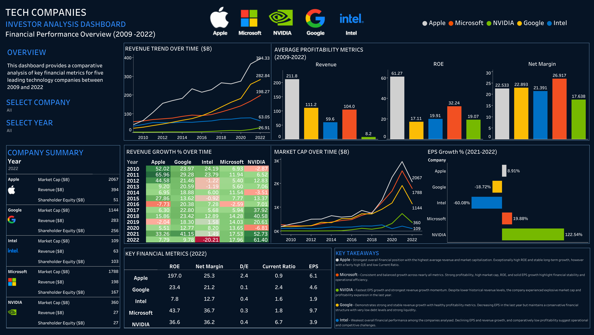

# 📈 Big Tech Financial Analysis

## 📋 Project Overview

This project entails a financial analysis of five major tech companies and their performance between 2009 and 2022, with the aim of providing insights for prospective investors. It served solely as an educational and analytical exercise and not as a definitive guide for financial advice. 

The project was conducted in May 2026, and in order to allow for a fair outcome, the analysis did not consider any events or financial developments occurring after 2022.

***Companies included in the analysis:***

- **Apple**
- **Microsoft**
- **Google**
- **NVIDIA**
- **Intel**

### 🛠️ Tools Used

- **Excel**
- **pgAdmin**
- **SQL (PostgreSQL)**
- **Tableau**

## 🧹🔎 Data Cleaning & Exploration

Following initial exploration of the data in Excel, next step included transferring the dataset into pgAdmin for reforming column names, look for outliers, data validation, and removing redundant data not applicable for the upcoming analysis.

Full cleaning and transformation process, including reasoning behind each action can be accessed here: [SQL Cleaning Process](./sql/sql-cleaning-process.md)

The SQL process also included an exploratory comparison analysis of the five companies.
This analysis primarily focused on developing an initial understanding of company performance and financial health before conducting deeper comparative analysis through visualisations.

Full SQL analysis process, including reasoning behind each action can be accessed here: [SQL Analysis Process](./sql/sql-analysis-process.md)

## 📊 Dashboard

[View Interactive Dashboard](https://public.tableau.com/views/TechCompaniesFinancialAnalysis/Dashboard1?:language=en-GB&:sid=&:redirect=auth&:display_count=n&:origin=viz_share_link)

## 💡 Key Insights

- **Microsoft** demonstrates the strongest overall investment profile
  The company combines strong profitability, stable revenue growth, financial stability, and relatively low leverage.
  In 2022, Microsoft records the highest net margin and continuous growth of earnings per share.

- **Apple** remains the largest and most profitable company.
  With a market cap and increasing revenues way above its competitors, the company continues to dominate its position as market leader.
  In 2022, Apple records an outstanding ROE of 197, yet also the highest D/E (2.4), and lowest current ratio of 0.9.

- **NVIDIA** shows the highest growth potential.
  The company certainly signalise a strong possibility for high investor returns, however, with an investment that carries greater risk and valuation sensitivity.
  In 2022, driven by rapid expansion, the company outperforms its average profitability ratios in all categories.

- **Google** maintained a financially conservative and stable profile.
  Supported by strong liquidity, low debt exposure, and consistent long-term growth, Google could be top choice for risk averse investors.
  In 2022 however, the company records a decline in EPS and a sigificantly lower revenue growth than previous year.

- **Intel** significantly underperformed competitors.
  With declining revenue, negative EPS growth, and overall weakening profitability, the company could be one of the riskiest options.
  In 2022, Intel records the lowest ROE, net marging, and earnings per share.

## ✅ Recommendations

**Low Risk Stable Option**

For investors seeking long-term stability and lower risk, Microsoft may be an excellent choice due to its strong profitability, and stable financial performance. Of the companies assessed in this analysis, Microsoft displays the most persuasive, well rounded investment proposition.

At the end of 2022, the company presents a very high 43.7% ROE while maintaining a highly conservative capital structure D/E of just 0.3 along with a healthy Current Ratio of 1.8, suggesting the company is not only generating strong returns for its shareholders, but is doing so without relying heavily on debt financing.

Additionally, Its net margin being top of the group and substantially higher than its average, indicates an increasing elite profitability and efficiency. While other tech giants decelerated rapidly in 2022, Microsoft maintained a robust 17.96% Revenue Growth and a solid 19.88% EPS Growth. This indicates resilience and could provide a promising oppportunity for investors seeking a combination of stability, profitability, and continued long-term growth.

**High Risk Growth Option**

For growth oriented investors with higher risk tolerance, NVIDIA could certainly pose as the most attractive opportunity because of its strong EPS expansion and AI-driven growth potential.

As evidenced by NVIDIA’s financial situation in 2022, the company presents a strong operational profitability growth with a 36.2% net margin that matches or beats the best in big tech. The fact that its ROE 36.6% is lower than Apple and Microsoft is however not an indicator of weak fundamental health. Rather, it highlights that NVIDIA achieved its explosive 2022 growth via a conservative, low debt, equity heavy capital structure with belief in its future growth potential and market positioning. 

Despite not having matured to the same stage as the rest of the group, NVIDIA completely dominates the dashboard in growth metrics over the past year, including an exceptional 122.54% EPS Growth and Revenue Growth of 61.40%.

From an investor perspective, NVIDIA shows a high-growth investment opportunity with substantial future potential linked to high tech expansion. However, its rapid valuation growth and dependence on future technological demand might also alert new investors to higher market volatility compared to more mature companies such as Apple and Microsoft.

❗ **Disclaimer**

When considering investing in any of these companies, investors may benefit from evaluating not only profitability and historical growth performance, but also current company valuation, future financial risks, long-term growth sustainability, and exposure to future technological developments and possibilities.

## ⚠️ Limitations

- Unfortunately, the dataset did not include free cash flow nor share price and therefore, the analysis does not include valuation metrics such as P/E ratio, free cash flow, or dividend yield, which are highly relevant for investment decision making. 

- The analysis is limited to five technology companies, operating with different goods and services and therefore does not represent the broader technology sector.

- The dashboard primarily relies on historical financial data between 2009 and 2022 and cannot predict future company performance but merely provide a picture of recent financial health.

- External macroeconomic events such as inflation, interest rate changes, and geopolitical developments are not directly assessed in this analysis.

- Some financial metrics, particularly ROE and EPS growth, can fluctuate significantly year to year and could have been influenced by accounting adjustments, stock buybacks, or temporary market conditions rather than poor investment decisions.

